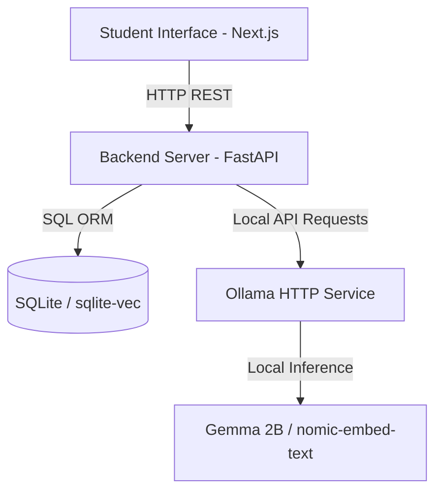

# Gemma Compass Documentation

Welcome to the technical documentation directory for **Gemma Compass**. 

This folder contains additional documentation and assets describing the system structure, user flows, and hackathon presentation guides.

## Contents
- **`overview.md`**: High-level system architecture and component designs.
- **`user_flows.md`**: Diagrammatic descriptions of student workflows (ingestion, tutoring, quiz diagnostic, roadmap review).

---

## High-Level System Architecture

Gemma Compass operates entirely locally on a student's machine:

1. **Document Ingestion**: File is uploaded through the Next.js dropzone, parsed via `pdfplumber`/`pytesseract`, chunked, embedded via `nomic-embed-text`, and saved in `sqlite-vec`.
2. **Translation & Concept Extraction**: Gemma identifies core terms and generates contextual side-by-side Hausa and English explanations.
3. **Bilingual Tutoring**: A chat interface that combines RAG retrieval with Gemma chat completions, matching student code-switching preferences.
4. **Adaptive MCQ Quiz**: System creates concept-mapped multiple choice questions. Incorrect submissions are written to a database `KnowledgeGap` table, producing a customized revision list.
